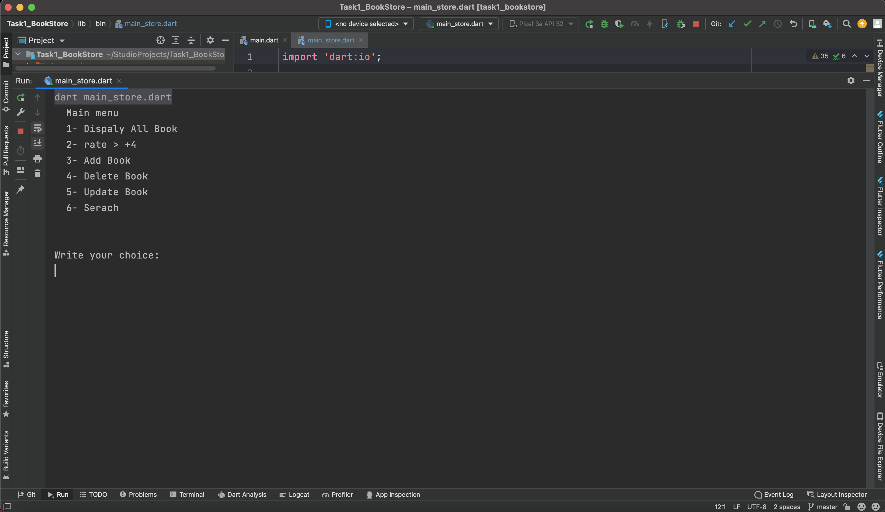
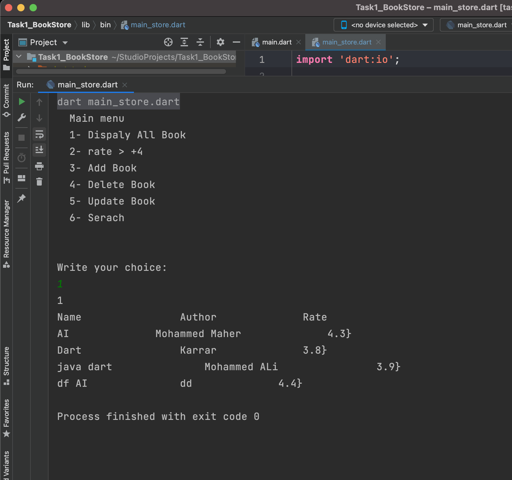
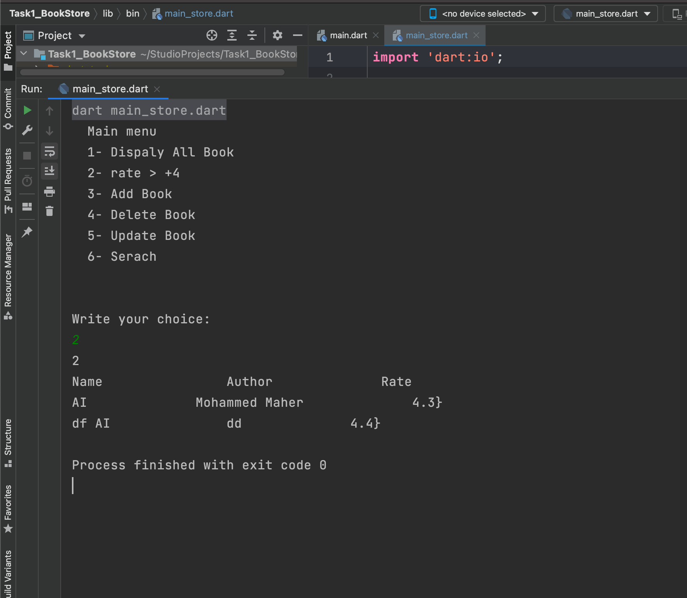
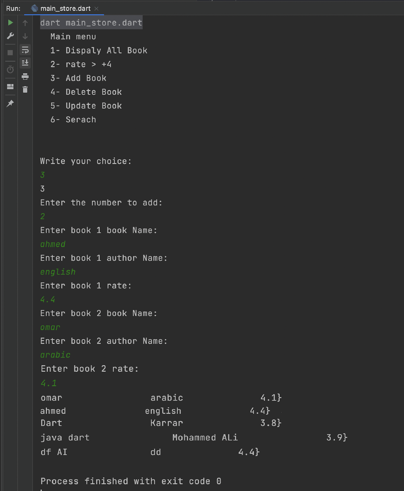
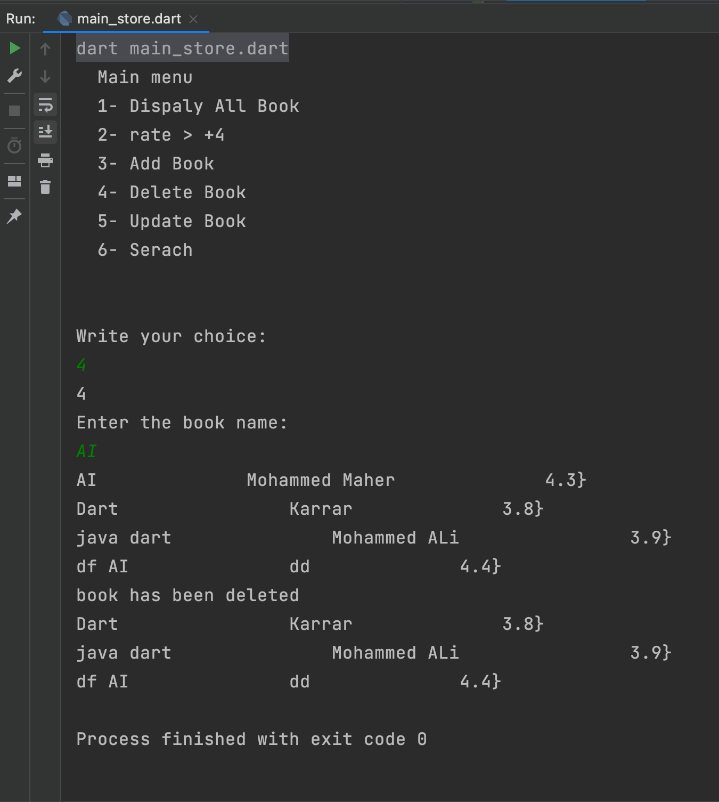
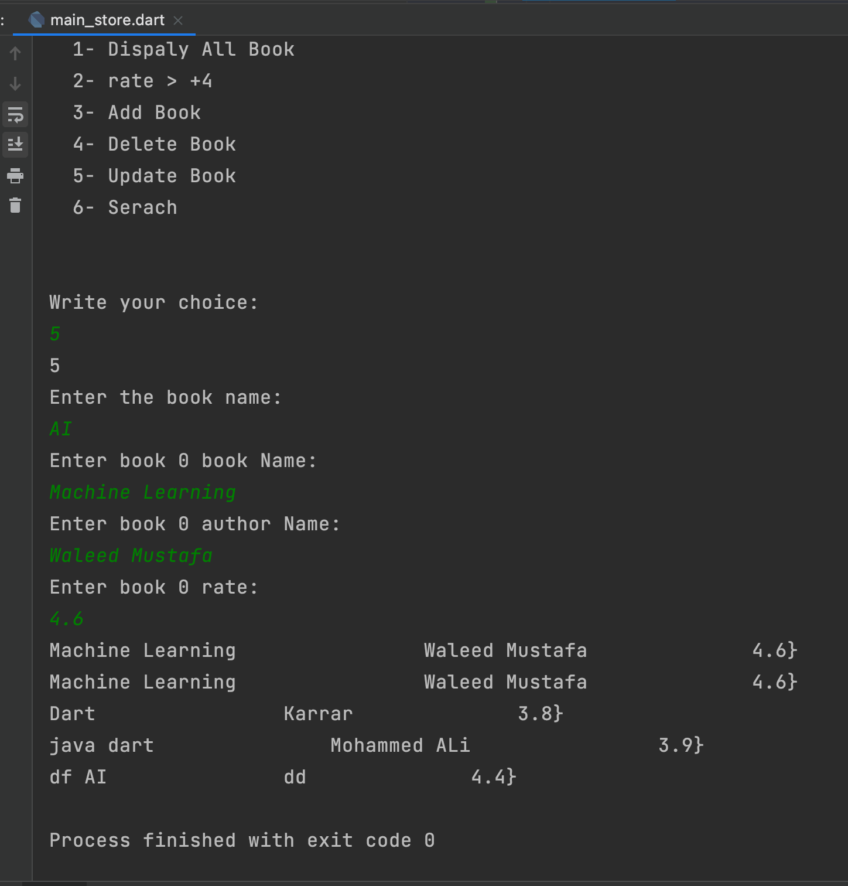
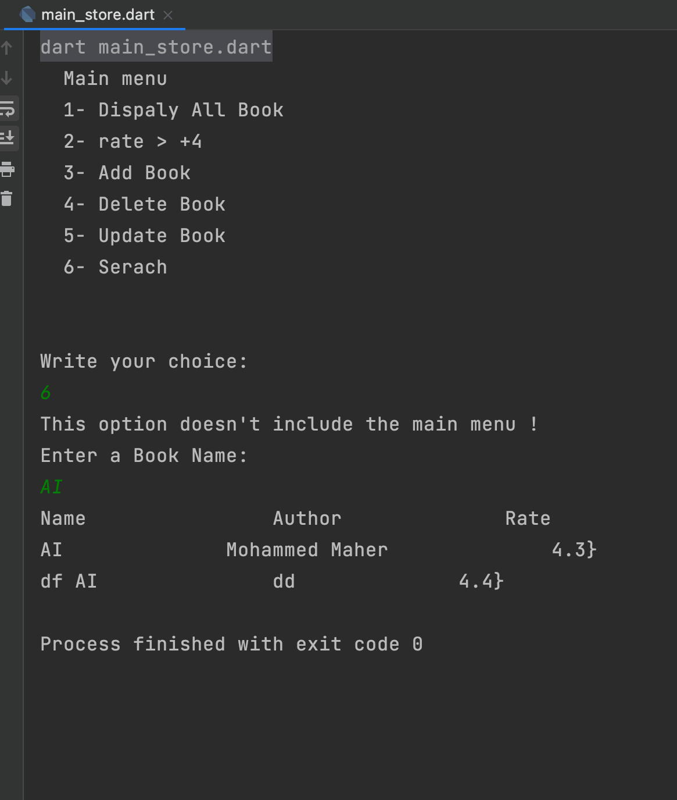

# Task 1: Book Store

Build a program that can be used for book store management. The book should has a unique name, author and rate. Use list to store the books.

## UI

When run program display main menu:
```
Main menu
1- Display all books
2- Display books with rate +4.
3- Add book
4- Update book
5- Delete book
6- Search
Write your choice:
```

## Display all books

print the details of all books. if there is no book then print “There is no book!”
```
Write your choice: 1
Book name        Book author         rate
java             Mohammed ALi        3.9
Learn Dart       Ali Ihsan           4.2


//if there is no books
There is no Books!
```

## Display books with rate +4

print the details of all books. if there is no book then print “There is no book!”
```
Write your choice: 2
Book name        Book author         rate
Learn Dart       Ali Ihsan           4.2

//if there is no books
There is no Books!
```

## Add book

Ask the user to enter the number of books he want to add then collect the data of each book as below:
```
Write your choice: 3
Enter the count of books want to add: 3
Enter book 1 name: Learn dart
Enter book 1 author: Ali Ahmed
Enter book 1 rate: 4.7
===============================
Enter book 2 name: java
Enter book 2 author: Mohammed Ihsan
Enter book 2 rate: 3.9
===============================
Enter book 3 name: php
Enter book 3 author: Mustafa Mawla
Enter book 3 rate: 4.5
```

## Update book

Ask the user to enter the name of the book to be updated:
```
Write your choice: 4
Enter the book name: Learn dart
Enter book 1 name: Learn dart in 7 days
Enter book 1 author: Ali Ahmed
Enter book 1 rate: 4.6
```

## Delete book

Ask the user to enter the name of the book to be deleted:
```
Write your choice: 5
Enter the book name: Learn dart
book has been deleted
```

## Search book

Ask the user to enter the name of the book for search:
```
Write your choice: 6
Enter a query: dart
Book name        Book author         rate
Learn Dart       Ali Ihsan           4.2
```

## ScreenShots

Main menu
 

Dispaly All Book


rate > +4 


Add Book


Delete Book


Update Book


Search


